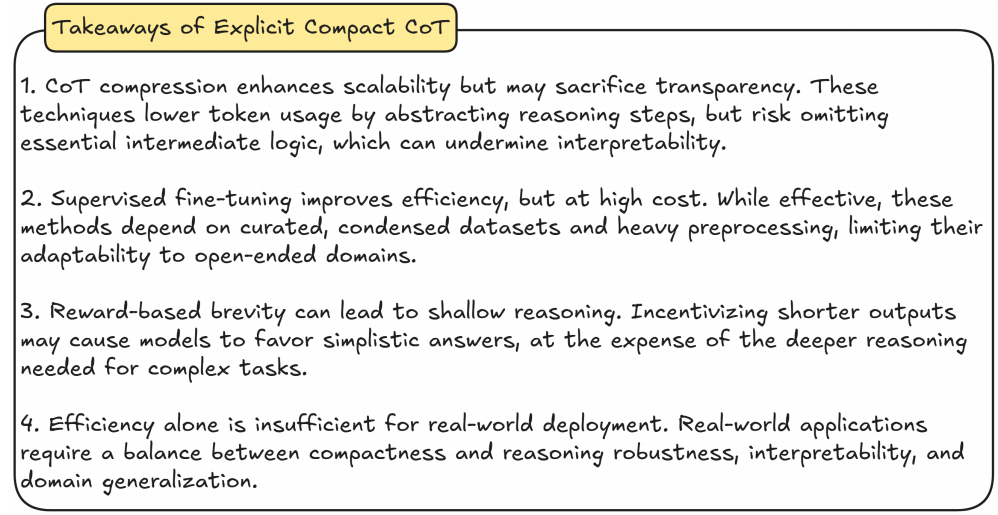
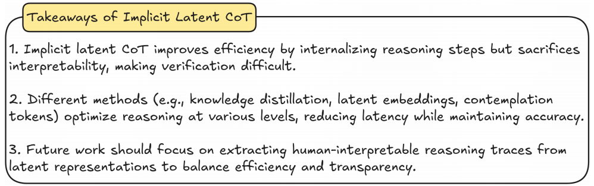
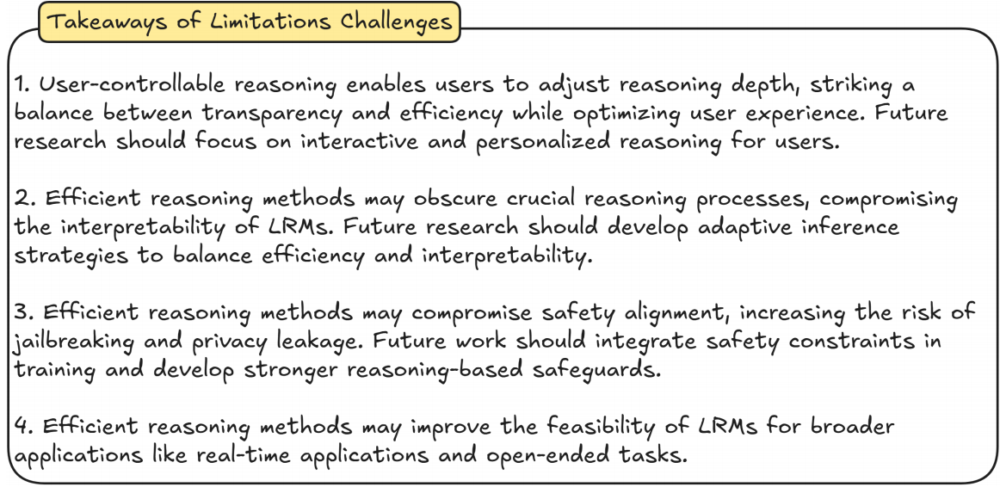
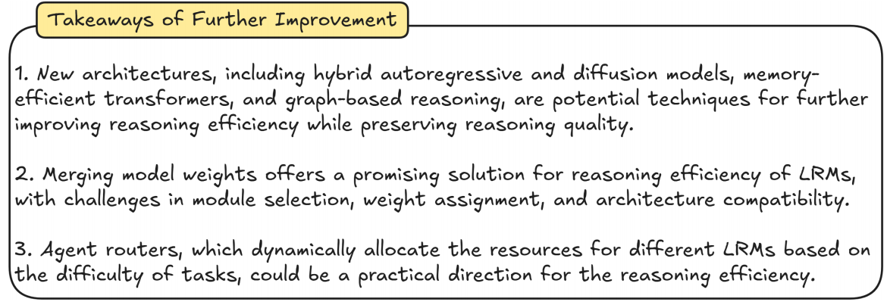

# Awesome-Efficient-Inference-for-LRMs

Awesome-Efficient-Inference-for-LRMs is a collection of state-of-the-art, novel, exciting, token-efficient methods for Large Reasoning Models (LRMs). It contains papers, codes, datasets, evaluations, and analyses. Any additional things regarding efficient inference for LRMs, PRs, and issues are welcome, and we are glad to add you to the contributor list [here](#contributors). Any problems, please contact yliu@u.nus.edu. Our survey paper is online: [Efficient Inference for Large Reasoning Models: A Survey](http://arxiv.org/pdf/2503.23077). If you find this repository useful to your research or work, it is really appreciated if to star this repository and cite our papers [here](#Reference). :sparkles:


## Bookmarks

- [Explicit Compact CoT](#explicit-compact-cot)
- [Implicit Latent CoT](#implicit-latent-cot)
- [Limitations and Challenges](#limitations-and-challenges)
  - [User-centric Controllable Reasoning](#user-centric-controllable-reasoning)
  - [Interpretability of Reasoning](#interpretability-of-reasoning)
  - [Reasoning Safety](#reasoning-safety)
  - [Broader Application](#broader-application)
- [Further Improvement](#further-improvement)
  - [New Architecture](#new-architecture)
  - [Model Merge](#model-merge)
  - [Agent Router](#agent-router)


## Papers
### Survey
| Time    | Title                                                        | Venue |                  Paper                   |                             Code                             |
| ------- | ------------------------------------------------------------ | :---: | :--------------------------------------: | :----------------------------------------------------------: |
| 2025.04 | **Reasoning Beyond Language: A Comprehensive Survey on Latent Chain-of-Thought Reasoning** |   arXiv'25     | [link](https://arxiv.org/pdf/2505.16782) |        [link](https://github.com/EIT-NLP/Awesome-Latent-CoT)      |
| 2025.04 | **Efficient Reasoning Models: A Survey** |   arXiv'25     | [link](https://arxiv.org/pdf/2504.10903) |        [link](https://github.com/fscdc/Awesome-Efficient-Reasoning-Models)      |
| 2025.03 | **Efficient Inference for Large Reasoning Models: A Survey** |   arXiv'25     | [link](https://arxiv.org/pdf/2503.23077) |        [link](https://github.com/yueliu1999/Awesome-Efficient-Inference-for-LRMs)      |
| 2025.03 | **Harnessing the Reasoning Economy: A Survey of Efficient Reasoning for Large Language Models** |   arXiv'25     | [link](https://arxiv.org/abs/2503.24377) |        [link](https://github.com/DevoAllen/Awesome-Reasoning-Economy-Papers)      |
| 2025.03 | **A Survey of Efficient Reasoning for Large Reasoning Models: Language, Multimodality, and Beyond** |   arXiv'25     | [link](https://arxiv.org/pdf/2503.21614) |        [link](https://github.com/XiaoYee/Awesome_Efficient_LRM_Reasoning)      |
| 2025.03 | **Stop Overthinking: A Survey on Efficient Reasoning for Large Language Models** |   arXiv'25     | [link](https://arxiv.org/pdf/2503.16419) |        [link](https://github.com/Eclipsess/Awesome-Efficient-Reasoning-LLMs)      |


### Explicit Compact CoT

| Time    | Title                                                        | Venue |                  Paper                   |                             Code                             |
| ------- | ------------------------------------------------------------ | :---: | :--------------------------------------: | :----------------------------------------------------------: |
| 2025.05 | **Can Pruning Improve Reasoning? Revisiting Long-CoT Compression with Capability in Mind for Better Reasoning** |   arXiv'25     | [link](https://arxiv.org/abs/2505.14582) |  -  |
| 2025.05 | **Long-Short Chain-of-Thought Mixture Supervised Fine-Tuning Eliciting Efficient Reasoning in Large Language Models** |   arXiv'25     | [link](https://arxiv.org/pdf/2505.03469) |        [link](https://github.com/ZGCA-AI4Edu/LS-Mixture)      |
| 2025.05 | **ConCISE: Confidence-guided Compression in Step-by-step Efficient Reasoning** |   arXiv'25     | [link](https://arxiv.org/abs/2505.19756) |        -      |
| 2025.05 | **Scalable Chain of Thoughts via Elastic Reasoning** |   arXiv'25     | [link](https://arxiv.org/pdf/2505.05315) |        -      |
| 2025.05 | **S-GRPO: Early Exit via Reinforcement Learning in Reasoning Models** |   arXiv'25     | [link](https://arxiv.org/pdf/2505.07686) |        -      |
| 2025.05 | **Making Small Language Models Efficient Reasoners: Intervention, Supervision, Reinforcement** |   arXiv'25     | [link](https://arxiv.org/pdf/2505.07961) |        -      |
| 2025.05 | **Accelerating Chain-of-Thought Reasoning: When Goal-Gradient Importance Meets Dynamic Skipping** |   arXiv'25     | [link](https://arxiv.org/pdf/2505.08392) |        -      |
| 2025.05 | **SelfBudgeter: Adaptive Token Allocation for Efficient LLM Reasoning** |   arXiv'25     | [link](https://arxiv.org/pdf/2505.11274) |        -      |
| 2025.05 | **Not All Thoughts are Generated Equal: Efficient LLM Reasoning via Multi-Turn Reinforcement Learning** |   arXiv'25     | [link](https://arxiv.org/pdf/2505.11827) |        [link](https://github.com/yasNing/Long-otimes-Short/)      |
| 2025.05 | **Fractured Chain-of-Thought Reasoning** |   arXiv'25     | [link](https://arxiv.org/pdf/2505.12992) |        -      |
| 2025.05 | **Efficient RL Training for Reasoning Models via Length-Aware Optimization** |   arXiv'25     | [link](https://arxiv.org/pdf/2505.12284) |        -      |
| 2025.05 | **DRP: Distilled Reasoning Pruning with Skill-aware Step Decomposition for Efficient Large Reasoning Models** |   arXiv'25     | [link](https://arxiv.org/pdf/2505.13975) |        -      |
| 2025.05 | **FlashThink: An Early Exit Method For Efficient Reasoning** |   arXiv'25     | [link](https://arxiv.org/pdf/2505.13949) |        -      |
| 2025.05 | **Optimizing Anytime Reasoning via Budget Relative Policy Optimization** |   arXiv'25     | [link](https://arxiv.org/pdf/2505.13438) |        [link](https://github.com/sail-sg/AnytimeReasoner)      |
| 2025.05 | **VeriThinker: Learning to Verify Makes Reasoning Model Efficient** |   arXiv'25     | [link](https://arxiv.org/pdf/2505.17941) |        [link](https://github.com/czg1225/VeriThinker)      |
| 2025.05 | **Reasoning Path Compression: Compressing Generation Trajectories for Efficient LLM Reasoning** |   arXiv'25     | [link](https://arxiv.org/pdf/2505.13866) |        [link](https://github.com/jiwonsong-dev/ReasoningPathCompression)      |
| 2025.05 | **ThinkLess: A Training-Free Inference-Efficient Method for Reducing Reasoning Redundancy** |   arXiv'25     | [link](https://arxiv.org/pdf/2505.15684) |        -      |
| 2025.05 | **Learn to Reason Efficiently with Adaptive Length-based Reward Shaping** |   arXiv'25     | [link](https://arxiv.org/pdf/2505.15612) |        [link](https://github.com/hkust-nlp/Laser)      |
| 2025.05 | **R1-Compress: Long Chain-of-Thought Compression via Chunk Compression and Search** |   arXiv'25     | [link](https://arxiv.org/pdf/2505.16838) |        [link](https://github.com/w-yibo/R1-Compress)      |
| 2025.05 | **Incentivizing Dual Process Thinking for Efficient Large Language Model Reasoning** |   arXiv'25     | [link](https://arxiv.org/pdf/2505.16315) |        -      |
| 2025.05 | **ConciseRL: Conciseness-Guided Reinforcement Learning for Efficient Reasoning Models** |   arXiv'25     | [link](https://www.arxiv.org/pdf/2505.17250) |        [link](https://github.com/RazvanDu/ConciseRL)      |
| 2025.05 | **TrimR: Verifier-based Training-Free Thinking Compression for Efficient Test-Time Scaling** |   arXiv'25     | [link](https://arxiv.org/pdf/2505.17155) |        -      |
| 2025.05 | **Not All Tokens Are What You Need In Thinking** |   arXiv'25     | [link](https://arxiv.org/pdf/2505.17827) |        [link](https://github.com/Faustrazor/Not-All-Thinking-Tokens)      |
| 2025.05 | **LIMOPro: Reasoning Refinement for Efficient and Effective Test-time Scaling** |   arXiv'25     | [link](https://arxiv.org/abs/2505.19756) |        [link](https://github.com/GAIR-NLP/LIMOPro)      |
| 2025.05 | **Walk Before You Run! Concise LLM Reasoning via Reinforcement Learning** |   arXiv'25     | [link](https://arxiv.org/pdf/2505.21178) |        [link](https://github.com/nick7nlp/ConciseR)      |
| 2025.05 | **CoThink: Token-Efficient Reasoning via Instruct Models Guiding Reasoning Models** |   arXiv'25     | [link](https://arxiv.org/pdf/2505.22017) |        -      |
| 2025.05 | **Don't Think Longer, Think Wisely: Optimizing Thinking Dynamics for Large Reasoning Models** |   arXiv'25     | [link](https://arxiv.org/pdf/2505.21765) |        -      |
| 2025.05 | **A\*-Thought: Efficient Reasoning via Bidirectional Compression for Low-Resource Settings** |   arXiv'25     | [link](https://arxiv.org/pdf/2505.24550) |        [link](https://github.com/AI9Stars/AStar-Thought)      |
| 2025.05 | **Efficient Reasoning via Chain of Unconscious Thought** |   arXiv'25     | [link](https://arxiv.org/abs/2505.19756) |        [link](https://github.com/Rohan-GRH/CoUT)      |
| 2025.04 | **Syzygy of Thoughts: Improving LLM CoT with the Minimal Free Resolution** |   arXiv'25     | [link](https://arxiv.org/pdf/2504.09566) |        [link](https://github.com/dlMARiA/Syzygy-of-thoughts)      |
| 2025.03 | **Sketch-of-thought: Efficient llm reasoning with adaptive cognitive-inspired sketching (SoT)** |   arXiv'25     | [link](https://arxiv.org/abs/2503.05179) |        [link](https://github.com/SimonAytes/SoT)      |
| 2025.03 | **SOLAR: Scalable Optimization of Large-scale Architecture for Reasoning** |   arXiv'25     | [link](https://arxiv.org/abs/2503.04530) |        -      |
| 2025.03 | **InftyThink: Breaking the Length Limits of Long-Context Reasoning in Large Language Models** |   arXiv'25     | [link](https://arxiv.org/abs/2503.06692) |        -      |
| 2025.03 | **L1: Controlling How Long A Reasoning Model Thinks With Reinforcement Learning** |   arXiv'25     | [link](https://arxiv.org/abs/2503.04697) |        [link](https://cmu-l3.github.io/l1/)      |
| 2025.03 | **Optimizing Test-Time Compute via Meta Reinforcement Fine-Tuning** |   arXiv'25     | [link](https://arxiv.org/abs/2503.07572) |        [link](https://cohenqu.github.io/mrt.github.io/)      |
| 2025.02 | **Chain of Draft: Thinking Faster by Writing Less** |   arXiv'25     | [link](https://arxiv.org/abs/2502.18600) |        [link](https://github.com/sileix/chain-of-draft)      |
| 2025.02 | **Meta-Reasoner: Dynamic Guidance for Optimized Inference-time Reasoning in Large Language Models** |   arXiv'25     | [link](https://arxiv.org/abs/2502.19918) |        -      |
| 2025.02 | **TokenSkip: Controllable Chain-of-Thought Compression in LLMs** |   arXiv'25     | [link](https://arxiv.org/abs/2502.12067) |        [link](https://github.com/hemingkx/TokenSkip)      |
| 2025.02 | **LightThinker: Thinking Step-by-Step Compression** |   arXiv'25     | [link](https://arxiv.org/abs/2502.155892) |        [link](https://arxiv.org/abs/2412.21006)      |
| 2025.02 | **CoT-Valve: Length-Compressible Chain-of-Thought Tuning** |   arXiv'25     | [link](https://arxiv.org/abs/2502.09601) |        -      |
| 2025.02 | **Self-Training Elicits Concise Reasoning in Large Language Models** |   arXiv'25     | [link](https://arxiv.org/abs/2502.20122) |        [link](https://github.com/TergelMunkhbat/concise-reasoning)      |
| 2025.02 | **DAST: Context-Aware Compression in LLMs via Dynamic Allocation of Soft Tokens** |   arXiv'25     | [link](https://arxiv.org/abs/2502.11493) |        -      |
| 2025.02 | **Training Language Models to Reason Efficiently** |   arXiv'25     | [link](https://arxiv.org/abs/2502.04463) |        [link](https://github.com/Zanette-Labs/efficient-reasoning)      |
| 2025.02 | **Anthropic. Claude 3.7 sonnet and claude code** |   Anthropic'25     | [link](https://www.anthropic.com/news/claude-3-7-sonnet) |        -      |
| 2025.02 | **Stepwise Perplexity-Guided Refinement for Efficient Chain-of-Thought Reasoning in Large Language Models** |   arXiv'25     | [link](https://arxiv.org/abs/2502.13260) |        -      |
| 2025.01 | **Kimi k1.5: Scaling Reinforcement Learning with LLMs** |   arXiv'25     | [link](https://arxiv.org/abs/2501.12599) |        -      |
| 2025.01 | **O1-Pruner: Length-Harmonizing Fine-Tuning for O1-Like Reasoning Pruning** |   arXiv'25     | [link](https://arxiv.org/abs/2501.12570) |        [link](https://github.com/StarDewXXX/O1-Pruner)      |
| 2025.01 | **Think Smarter not Harder: Adaptive Reasoning with Inference Aware Optimization** |   arXiv'25     | [link](https://arxiv.org/abs/2501.17974) |        -      |
| 2024.12 | **C3oT: Generating Shorter Chain-of-Thought without Compromising Effectiveness** |   arXiv'24     | [link](https://arxiv.org/abs/2412.11664) |        -      |
| 2024.12 | **Token-Budget-Aware LLM Reasoning** |   arXiv'24     | [link](https://arxiv.org/abs/2412.18547) |        [link](https://github.com/GeniusHTX/TALE)      |
| 2024.12 | **Verbosity-Aware Rationale Reduction: Effective Reduction of Redundant Rationale via Principled Criteria** |   arXiv'24     | [link](https://arxiv.org/abs/2412.21006) |        -      |
| 2024.11 | **Can Language Models Learn to Skip Steps?** |   arXiv'24     | [link](https://arxiv.org/abs/2411.01855) |        [link](https://github.com/tengxiaoliu/LM_skip)      |
| 2024.07 | **Concise Thoughts: Impact of Output Length on LLM Reasoning and Cost** |   arXiv'24     | [link](https://export.arxiv.org/abs/2407.19825) |        -      |
| 2024.07 | **Distilling System 2 into System 1** |   arXiv'24     | [link](https://arxiv.org/abs/2407.06023) |        -      |





### Implicit Latent CoT


| Time | Title   |  Venue   | Paper | Code |
| ---- | ------- | :------: | :---: | :--: |
| 2025.05 | **Soft Thinking: Unlocking the Reasoning Potential of LLMs in Continuous Concept Space** |   arXiv'25     | [link](https://arxiv.org/pdf/2505.15778) |        [link](https://github.com/eric-ai-lab/Soft-Thinking)      |
| 2025.05 | **Think Silently, Think Fast: Dynamic Latent Compression of LLM Reasoning Chains** |   arXiv'25     | [link](https://arxiv.org/pdf/2505.16552) |        [link](https://colar-latent-reasoning.github.io/)      |
| 2025.02 | **CODI: Compressing Chain-of-Thought into Continuous Space via Self-Distillation** |   arXiv'25     | [link](https://arxiv.org/abs/2502.21074) |        -      |
| 2025.02 | **Token Assorted: Mixing Latent and Text Tokens for Improved Language Model Reasoning** |   arXiv'25     | [link](https://arxiv.org/abs/2502.03275) |        -      |
| 2025.02 | **SoftCoT: Soft Chain-of-Thought for Efficient Reasoning with LLMs** |   arXiv'25     | [link](https://arxiv.org/abs/2502.12134) |        -      |
| 2025.01 | **Efficient Reasoning with Hidden Thinking** |   arXiv'25     | [link](https://arxiv.org/abs/2501.19201v1) |        [link](https://github.com/shawnricecake/Heima)      |
| 2024.12 | **Training Large Language Models to Reason in a Continuous Latent Space** |   arXiv'24     | [link](https://arxiv.org/abs/2412.06769) |        -      |
| 2024.12 | **Compressed Chain of Thought: Efficient Reasoning Through Dense Representations** |   arXiv'24     | [link](https://arxiv.org/abs/2412.13171) |        -      |
| 2024.05 | **From Explicit CoT to Implicit CoT: Learning to Internalize CoT Step by Step** |   arXiv'24     | [link](https://arxiv.org/abs/2405.14838) |        [link](https://github.com/da03/Internalize_CoT_Step_by_Step)      |
| 2023.11 | **Implicit Chain of Thought Reasoning via Knowledge Distillation** |   arXiv'23     | [link](https://arxiv.org/abs/2311.01460) |        [link](https://github.com/da03/implicit_chain_of_thought/)      |




### Limitations and Challenges

#### User-centric Controllable Reasoning

| Time | Title   |  Venue   | Paper | Code |
| ---- | ------- | :------: | :---: | :--: |
| 2025.02 | **OpenAI o3-mini System Card** |   OpenAI'25     | [link](https://cdn.openai.com/o3-mini-system-card-feb10.pdf) |        -      |
| 2025.02 | **Anthropic. Claude 3.7 sonnet and claude code** |   Anthropic'25     | [link](https://www.anthropic.com/news/claude-3-7-sonnet) |        -      |


#### Interpretability of Reasoning
| Time | Title   |  Venue   | Paper | Code |
| ---- | ------- | :------: | :---: | :--: |
| 2024.05 | **FiDeLiS: Faithful Reasoning in Large Language Model for Knowledge Graph Question Answering** |   arXiv'24     | [link](https://arxiv.org/abs/2405.13873v1) |        -      |
| 2024.02 | **Challenges and barriers of using large language models (LLM) such as ChatGPT for diagnostic medicine with a focus on digital pathology - a recent scoping review** |   Diagnostic pathology'24     | [link](https://diagnosticpathology.biomedcentral.com/articles/10.1186/s13000-024-01464-7) |        -      |
| 2024.02 | **(A)I Am Not a Lawyer, But...: Engaging Legal Experts towards Responsible LLM Policies for Legal Advice** |   arXiv'24     | [link](https://arxiv.org/abs/2402.01864) |        -      |
| 2023.12 | **Retrieval-Augmented Generation for Large Language Models: A Survey** |   arXiv'23     | [link](https://arxiv.org/abs/2312.10997) |        [link](https://github.com/Tongji-KGLLM/RAG-Survey)      |
| 2023.10 | **Contribution and performance of ChatGPT and other Large Language Models (LLM) for scientific and research advancements: a double-edged sword** |   International Research Journal of Modernization in Engineering Technology and Science'23     | [link](https://www.researchgate.net/publication/374616494_Contribution_and_performance_of_ChatGPT_and_other_Large_Language_Models_LLM_for_scientific_and_research_advancements_a_double-edged_sword) |        -      |
| 2023.08 | **Reasoning in Large Language Models Through Symbolic Math Word Problems** |   arXiv'23     | [link](https://arxiv.org/abs/2308.01906) |        -      |
| 2021.12 | **Chapter 1. Neural-Symbolic Learning and Reasoning: A Survey and Interpretation1** |   Neuro-Symbolic Artificial Intelligence'21     | [link](https://www.researchgate.net/publication/357534103_Chapter_1_Neural-Symbolic_Learning_and_Reasoning_A_Survey_and_Interpretation1) |        -      |


#### Reasoning Safety

| Time | Title   |  Venue   | Paper | Code |
| ---- | ------- | :------: | :---: | :--: |
| 2025.03 | **Optimizing Test-Time Compute via Meta Reinforcement Fine-Tuning** |   arXiv'25     | [link](https://arxiv.org/abs/2503.07572) |        [link](https://cohenqu.github.io/mrt.github.io/)      |
| 2025.03 | **Detecting misbehavior in frontier reasoning models** |   OpenAI'25     | [link](https://openai.com/index/chain-of-thought-monitoring/) |        -      |
| 2025.02 | **Evaluating the Paperclip Maximizer: Are RL-Based Language Models More Likely to Pursue Instrumental Goals?** |   arXiv'25     | [link](https://arxiv.org/abs/2502.12206) |        [link](https://github.com/yf-he/InstrumentalEval)      |
| 2025.01 | **O1-Pruner: Length-Harmonizing Fine-Tuning for O1-Like Reasoning Pruning** |   arXiv'25     | [link](https://arxiv.org/abs/2501.12570) |        [link](https://github.com/StarDewXXX/O1-Pruner)      |
| 2025.01 | **GuardReasoner: Towards Reasoning-based LLM Safeguards** |   arXiv'25     | [link](https://arxiv.org/abs/2501.18492) |        [link](https://github.com/yueliu1999/GuardReasoner/)      |
| 2025.01 | **Kimi k1.5: Scaling Reinforcement Learning with LLMs** |   arXiv'25     | [link](https://arxiv.org/abs/2501.12599) |        -      |
| 2024.12 | **C3oT: Generating Shorter Chain-of-Thought without Compromising Effectiveness** |   arXiv'24     | [link](https://arxiv.org/abs/2412.11664) |        -      |
| 2024.10 | **FlipAttack: Jailbreak LLMs via Flipping** |   arXiv'24     | [link](https://arxiv.org/abs/2410.02832) |        [link](https://github.com/yueliu1999/FlipAttack)      |
| 2023.10 | **Privacy in Large Language Models: Attacks, Defenses and Future Directions** |   arXiv'23     | [link](https://arxiv.org/abs/2310.10383) |        -      |


#### Broader Application
| Time | Title   |  Venue   | Paper | Code |
| ---- | ------- | :------: | :---: | :--: |
| 2025.03 | **SOLAR: Scalable Optimization of Large-scale Architecture for Reasoning** |   arXiv'25     | [link](https://arxiv.org/abs/2503.04530) |        -      |
| 2025.03 | **Large language models (LLM) in computational social science: prospects, current state, and challenges** |   Social Network Analysis and Mining'25     | [link](https://link.springer.com/article/10.1007/s13278-025-01428-9) |        -      |
| 2025.03 | **Gemini robotics brings ai into the physical world** |   Google'25     | [link](https://deepmind.google/discover/blog/gemini-robotics-brings-ai-into-the-physical-world/) |        -      |
| 2025.03 | **Nvidia isaac gr00t n1: An open foundation model for humanoid robots.** |   Nvidia'25     | [link](https://research.nvidia.com/publication/2025-03_nvidia-isaac-gr00t-n1-open-foundation-model-humanoid-robots) |        -      |
| 2025.02 | **Anthropic. Claude 3.7 sonnet and claude code** |   Anthropic'25     | [link](https://www.anthropic.com/news/claude-3-7-sonnet) |        -      |
| 2025.02 | **TokenSkip: Controllable Chain-of-Thought Compression in LLMs** |   arXiv'25     | [link](https://arxiv.org/abs/2502.12067) |        [link](https://github.com/hemingkx/TokenSkip)      |
| 2025.02 | **RoboBrain: A Unified Brain Model for Robotic Manipulation from Abstract to Concrete** |   arXiv'25     | [link](https://arxiv.org/abs/2502.21257) |        -     |
| 2025.02 | **From Personas to Talks: Revisiting the Impact of Personas on LLM-Synthesized Emotional Support Conversations** |   arXiv'25     | [link](https://arxiv.org/abs/2502.11451) |        -      |
| 2025.02 | **Introducing deep research** |   OpenAI'25     | [link](https://openai.com/index/introducing-deep-research/) |        -      |
| 2025.02 | **Introducing gpt-4.5** |   OpenAI'25     | [link](https://openai.com/index/introducing-gpt-4-5/) |        -      |
| 2025.01 | **Kimi k1.5: Scaling Reinforcement Learning with LLMs** |   arXiv'25     | [link](https://arxiv.org/abs/2501.12599) |        -      |
| 2024.12 | **Compressed Chain of Thought: Efficient Reasoning Through Dense Representations** |   arXiv'24     | [link](https://arxiv.org/abs/2412.13171) |        -      |
| 2024.08 | **Large Language Model Agent in Financial Trading: A Survey** |   arXiv'24     | [link](https://arxiv.org/abs/2408.06361) |        -      |
| 2024.04 | **Automated Social Science: Language Models as Scientist and Subjects** |   arXiv'24     | [link](https://arxiv.org/abs/2404.11794) |        [link](https://benjaminmanning.io/)      |
| 2023.11 | **LLM4Drive: A Survey of Large Language Models for Autonomous Driving** |   arXiv'24     | [link](https://arxiv.org/abs/2311.01043) |        [link](https://github.com/Thinklab-SJTU/Awesome-LLM4AD)      |




### Further Improvement

#### New Architecture
| Time | Title   |  Venue   | Paper | Code |
| ---- | ------- | :------: | :---: | :--: |
| 2025.02 | **Large Language Diffusion Models** |   arXiv'25     | [link](https://arxiv.org/abs/2502.09992) |        [link](https://ml-gsai.github.io/LLaDA-demo/)      |
| 2025.02 | **UniGraph2: Learning a Unified Embedding Space to Bind Multimodal Graphs** |   arXiv'25     | [link](https://arxiv.org/abs/2502.00806) |        [link](https://github.com/yf-he/UniGraph2)      |
| 2024.03 | **Graph of Thoughts: Solving Elaborate Problems with Large Language Models** |   AAAI Conference on Artificial Intelligence'24     | [link](https://ojs.aaai.org/index.php/AAAI/article/view/29720) |        [link](https://github.com/yf-he/UniGraph)      |
| 2024.02 | **UniGraph: Learning a Unified Cross-Domain Foundation Model for Text-Attributed Graphs** |   arXiv'24     | [link](https://arxiv.org/abs/2402.13630) |        [link](https://github.com/spcl/graph-of-thoughts)      |
| 2023.12 | **Mamba: Linear-Time Sequence Modeling with Selective State Spaces** |   arXiv'23     | [link](https://arxiv.org/abs/2312.00752) |        [link](https://github.com/state-spaces/mamba)      |
| 2023.10 | **Language Agent Tree Search Unifies Reasoning Acting and Planning in Language Models** |   arXiv'23     | [link](https://arxiv.org/abs/2310.04406) |        [link](https://github.com/lapisrocks/LanguageAgentTreeSearch)      |
| 2023.05 | **RWKV: Reinventing RNNs for the Transformer Era** |   arXiv'23     | [link](https://arxiv.org/abs/2305.13048) |        [link](https://github.com/BlinkDL/RWKV-LM)      |
| 2017.10 | **Mastering the game of Go without human knowledge** |   nature'17     | [link](https://www.nature.com/articles/nature24270) |        -      |


#### Model Merge 
| Time | Title   |  Venue   | Paper | Code |
| ---- | ------- | :------: | :---: | :--: |
| 2025.06 | **Accelerated Test-Time Scaling with Model-Free Speculative Sampling** |   arXiv'25     | [link](https://arxiv.org/abs/2506.04708) |        -      |
| 2025.03 | **Unlocking Efficient Long-to-Short LLM Reasoning with Model Merging** |   arXiv'25     | [link](https://arxiv.org/abs/2503.20641) |        [link](https://github.com/hahahawu/Long-to-Short-via-Model-Merging)      |
| 2025.03 | **SOLAR: Scalable Optimization of Large-scale Architecture for Reasoning** |   arXiv'25     | [link](https://arxiv.org/abs/2503.04530) |        -      |
| 2025.03 | **Optimizing Test-Time Compute via Meta Reinforcement Fine-Tuning** |   arXiv'25     | [link](https://arxiv.org/abs/2503.07572) |        [link](https://cohenqu.github.io/mrt.github.io/)      |
| 2025.02 | **Meta-Reasoner: Dynamic Guidance for Optimized Inference-time Reasoning in Large Language Models** |   arXiv'25     | [link](https://arxiv.org/abs/2502.19918) |        -      |
| 2025.01 | **Kimi k1.5: Scaling Reinforcement Learning with LLMs** |   arXiv'25     | [link](https://arxiv.org/abs/2501.12599) |        -      |
| 2025.01 | **DeepSeek-R1: Incentivizing Reasoning Capability in LLMs via Reinforcement Learning** |   arXiv'25     | [link](https://arxiv.org/abs/2501.12948) |        -      |
| 2024.12 | **Token-Budget-Aware LLM Reasoning** |   arXiv'24     | [link](https://arxiv.org/abs/2412.18547) |        [link](https://github.com/GeniusHTX/TALE)      |
| 2024.08 | **Model Merging in LLMs, MLLMs, and Beyond: Methods, Theories, Applications and Opportunities** |   arXiv'24     | [link](https://arxiv.org/abs/2408.07666) |        [link](https://github.com/EnnengYang/Awesome-Model-Merging-Methods-Theories-Applications)      |
| 2024.07 | **The Llama 3 Herd of Models** |   arXiv'24     | [link](https://arxiv.org/abs/2407.21783) |        [link](https://llama.meta.com/)      |


#### Agent Router
| Time | Title   |  Venue   | Paper | Code |
| ---- | ------- | :------: | :---: | :--: |
| 2025.04 | **SpecReason: Fast and Accurate Inference-Time Compute via Speculative Reasoning** | arXiv'25 | [link](https://arxiv.org/abs/2504.07891) | [link](https://github.com/ruipeterpan/specreason) |
| 2025.02 | **Confident or Seek Stronger: Exploring Uncertainty-Based On-device LLM Routing From Benchmarking to Generalization** |   arXiv'25     | [link](https://arxiv.org/abs/2502.04428) |        -      |
| 2025.01 | **RouteLLM: Learning to Route LLMs from Preference Data** |   The Thirteenth International Conference on Learning Representations'25     | [link](https://openreview.net/forum?id=8sSqNntaMr) |        -      |
| 2024.10 | **Learning to Route LLMs with Confidence Tokens** |   arXiv'24     | [link](https://arxiv.org/abs/2410.13284) |        -      |
| 2024.09 | **RouterDC: Query-Based Router by Dual Contrastive Learning for Assembling Large Language Models** | The Thirty-Ninth Annual Conference on Neural Information Processing Systems | [link](https://openreview.net/pdf?id=7RQvjayHrM) |





## Reference

If you find this repository helpful to your research, it is really appreciated if to cite our papers. :sparkles:

```
@article{liu2025efficient,
  title={Efficient Inference for Large Reasoning Models: A Survey},
  author={Liu, Yue and Wu, Jiaying and He, Yufei and Gao, Hongcheng and Chen, Hongyu and Bi, Baolong and Zhang, Jiaheng and Huang, Zhiqi and Hooi, Bryan},
  journal={arXiv preprint arXiv:2503.23077},
  year={2025}
}
```


## Contributors

<a href="https://github.com/yueliu1999" target="_blank"></a> 
<a href="https://github.com/jiayingwu19" target="_blank"></a> 
<a href="https://github.com/yf-he" target="_blank"></a> 
<a href="https://github.com/bhooi" target="_blank"></a> 
<a href="https://github.com/Rohan-GRH" target="_blank"></a> 


<p align="right">(<a href="#top">back to top</a>)</p>


