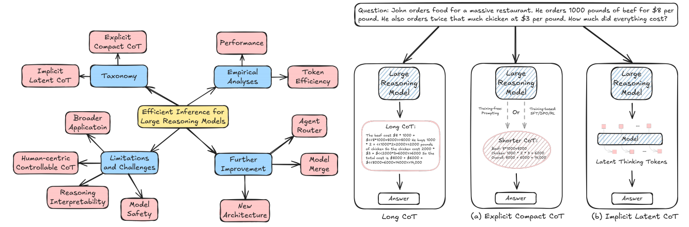

# Awesome-Efficient-Inference-for-LRMs

Awesome-Efficient-Inference-for-LRMs is a collection of state-of-the-art, novel, exciting token efficient methods for Large Reasoning Models (LRMs). It contains papers, codes, datasets, evaluations, and analyses. Any additional things regarding efficient inference for LRMs, PRs, issues are welcome and we are glad to add you to the contributor list [here](#contributors). Any problems, please contact yliu@u.nus.edu. If you find this repository useful to your research or work, it is really appreciated to star this repository and cite our papers [here](#Reference). :sparkles:




## Bookmarks

- [Explicit Compact CoT](#explicit-compact-cot)
- [Implicit Latent CoT](#implicit-latent-cot)


## Papers


### Explicit Compact CoT

| Time    | Title                                                        | Venue |                  Paper                   |                             Code                             |
| ------- | ------------------------------------------------------------ | :---: | :--------------------------------------: | :----------------------------------------------------------: |
| 2025.03 | **Sketch-of-thought: Efficient llm reasoning with adaptive cognitive-inspired sketching (SoT)** |   arXiv'25     | [link](https://arxiv.org/abs/2503.05179) |        [link](https://github.com/SimonAytes/SoT)      |


### Implicit Latent CoT


| Time | Title   |  Venue   | Paper | Code |
| ---- | ------- | :------: | :---: | :--: |
| xxx  | **xxx** | arXiv'25 |  xx   |  -   |


## Reference

If you find this repository helpful to your research, it is really appreciated to cite our papers. :sparkles:

```

```


## Contributors

<a href="https://github.com/yueliu1999" target="_blank"></a> 
<a href="https://github.com/jiayingwu19" target="_blank"></a> 
<a href="https://github.com/yf-he" target="_blank"></a> 
<a href="https://github.com/bhooi" target="_blank"></a> 


<p align="right">(<a href="#top">back to top</a>)</p>


